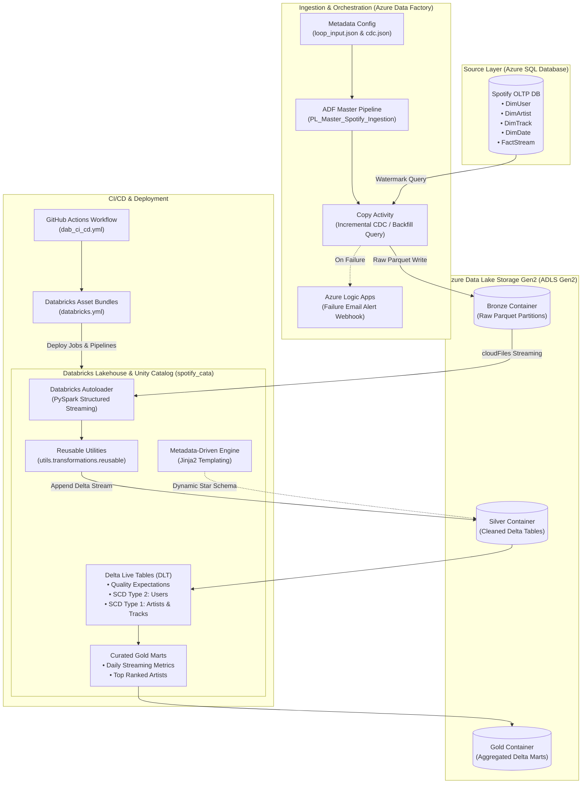

# Spotify End-to-End Azure Data Engineering Project

[](https://azure.microsoft.com/)
[](https://databricks.com/)
[](https://spark.apache.org/)
[](https://python.org/)
[](https://github.com/)


---

## Table of Contents
1. [Project Overview & Key Highlights](#project-overview--key-highlights)
2. [End-to-End Architecture](#end-to-end-architecture)
3. [Repository Directory Structure](#repository-directory-structure)
4. [Step-by-Step Implementation Guide](#step-by-step-implementation-guide)
   - [Phase 1: Azure Infrastructure & Source System](#phase-1-azure-infrastructure--source-system)
   - [Phase 2: Azure Data Factory (ADF) Ingestion](#phase-2-azure-data-factory-adf-ingestion)
   - [Phase 3: Azure Logic Apps Alerting](#phase-3-azure-logic-apps-alerting)
   - [Phase 4: Databricks Unity Catalog & Autoloader (Silver Layer)](#phase-4-databricks-unity-catalog--autoloader-silver-layer)
   - [Phase 5: Metadata-Driven Pipeline with Jinja2](#phase-5-metadata-driven-pipeline-with-jinja2)
   - [Phase 6: Delta Live Tables (DLT) & Slowly Changing Dimensions (Gold Layer)](#phase-6-delta-live-tables-dlt--slowly-changing-dimensions-gold-layer)
   - [Phase 7: Incremental CDC Ingestion Testing](#phase-7-incremental-cdc-ingestion-testing)
   - [Phase 8: Databricks Asset Bundles (DAB) & CI/CD](#phase-8-databricks-asset-bundles-dab--cicd)
5. [Local Offline Simulation Guide (Zero Azure Cost)](#local-offline-simulation-guide-zero-azure-cost)
6. [Testing & Quality Assurance](#testing--quality-assurance)
7. [Data Engineering Interview Q&A & Talking Points](#data-engineering-interview-qa--talking-points)

---

## Project Overview & Key Highlights

This project implements an end-to-end modern data platform on Microsoft Azure and Databricks simulating Spotify streaming logs and user metadata:

- **Source System:** Azure SQL Database containing dimensional entity tables (`DimUser`, `DimArtist`, `DimTrack`, `DimDate`) and transactional fact table (`FactStream`).
- **Watermark-Driven CDC Ingestion:** Parameterized Azure Data Factory (ADF) pipelines with dynamic querying, looping configuration (`loop_input.json`), backfilling capabilities, and watermark timestamp persistence (`cdc.json`).
- **Storage Lakehouse:** Azure Data Lake Storage Gen2 (ADLS Gen2) structured into standard **Medallion Layers** (`bronze`, `silver`, `gold`).
- **Alerting & Observability:** Real-time Webhook failure notification via Azure Logic Apps sending HTML error diagnostics.
- **Lakehouse Governance:** Databricks **Unity Catalog** (`spotify_cata`) with 3-tier namespaces, storage credentials, and external locations.
- **Streaming Ingestion (Silver):** PySpark Structured Streaming with **Databricks Autoloader** (`cloudFiles`), automatic schema evolution, and reusable transformation utilities (`reusable` class).
- **Metadata-Driven Query Generation:** Dynamic Star Schema joins rendered via **Jinja2 templating**.
- **Declarative Gold Pipelines:** **Delta Live Tables (DLT)** enforcing data quality expectations (`@dlt.expect_or_drop`), combined with **Slowly Changing Dimensions (SCD Type 1 & Type 2)** using `dlt.apply_changes()`.
- **Modern DevOps:** Infrastructure and pipeline packaging using **Databricks Asset Bundles (DAB)** with automated GitHub Actions CI/CD workflows (`dev` and `prod` targets).
- **Local Simulation Engine:** Full offline test runner (`local_simulation/simulate_pipeline.py`) capable of running the entire pipeline locally without cloud subscriptions.

---

## End-to-End Architecture



---

## Repository Directory Structure

```text
e:\DE Project\
├── README.md                              # Complete end-to-end documentation & walkthrough
├── loop_input.json                        # ADF metadata loop definition (tables, cdc columns)
├── loop_input                             # Original tutorial loop definition
├── cdc.json                               # Watermark tracking timestamp for CDC
├── empty.json                             # Baseline empty payload
│
├── source_scripts/                        # Azure SQL Database Scripts
│   ├── spotify_initial_load.sql           # DDL & 500+ records initial insert (Spotify mock data)
│   └── spotify_incremental_load.sql       # CDC batch for incremental load & SCD testing
│
├── adf/                                   # Azure Data Factory Artifacts
│   ├── pipelines/
│   │   └── PL_Master_Spotify_Ingestion.json # Master looping & CDC copy pipeline
│   ├── linked_services/
│   │   ├── LS_AzureSqlDatabase.json       # Linked Service to Azure SQL DB
│   │   └── LS_AzureDataLakeStorageGen2.json # Linked Service to ADLS Gen2
│   ├── datasets/
│   │   ├── DS_AzureSql_Spotify.json       # Source parameterized SQL dataset
│   │   ├── DS_ADLS_Bronze_Parquet.json    # Bronze sink Parquet dataset
│   │   └── DS_ADLS_Config_JSON.json       # Control JSON reader dataset
│   └── logic_apps/
│       └── alert_workflow.json            # Logic App ARM template for email alert webhooks
│
├── databricks/                            # Databricks Lakehouse & Asset Bundles
│   ├── databricks.yml                     # DAB deployment configuration (dev/prod targets)
│   ├── resources/
│   │   ├── spotify_workflow_job.yml       # Multi-task Orchestration Workflow Job
│   │   └── spotify_dlt_pipeline.yml       # DLT Pipeline resource specification
│   ├── src/
│   │   ├── silver/
│   │   │   └── silver_dimensions.py       # Autoloader streaming ingestion & transformations
│   │   ├── gold/
│   │   │   ├── dlt_gold_pipeline.py       # DLT Pipeline with SCD Type 1 & 2 + Gold Marts
│   │   │   └── jinja_star_schema.py       # Metadata-driven Jinja2 dynamic SQL generator
│   │   └── utils/
│   │       └── transformations.py         # Reusable PySpark transformation class
│   ├── notebooks/                         # Databricks workspace interactive notebooks
│   │   ├── 01_silver_dimensions.py        # Interactive Silver Autoloader notebook
│   │   ├── 02_jinja_metadata_pipeline.py  # Interactive Jinja2 templating notebook
│   │   ├── 03_gold_dlt_pipeline.py        # Interactive DLT pipeline notebook
│   │   └── 04_sample_gold_analytics.py    # Analytical SQL queries & validation
│   └── Databricks Code/
│       └── spotify_dab.dbc                # Original Databricks workspace DBC archive
│
├── local_simulation/                      # Offline Simulator (Runs 100% locally with Polars/PyArrow)
│   ├── simulate_pipeline.py               # Complete end-to-end local simulation script
│   └── run_simulation.bat                 # One-click Windows runner batch file
│
├── tests/                                 # Unit & Integration Tests
│   ├── test_transformations.py            # Unit tests for transformations
│   └── test_jinja_template.py             # Pytest tests for Jinja2 SQL query builder
│
└── .github/
    └── workflows/
        └── dab_ci_cd.yml                  # GitHub Actions CI/CD for DAB bundle deployment
```

---

## Step-by-Step Implementation Guide

### Phase 1: Azure Infrastructure & Source System

1. **Azure Resource Group**: Create `rg-spotify-project` in your preferred Azure region (e.g., `East US`).
2. **Azure Storage Account (ADLS Gen2)**:
   - Create storage account with **Hierarchical Namespace enabled** (e.g., `storageazureproject`).
   - Create three containers:
     - `bronze` : Raw immutable ingested files.
     - `silver` : Cleaned, deduplicated Delta tables.
     - `gold`   : Curated dimensional tables and analytical business marts.
   - Upload `loop_input.json` and `cdc.json` into `bronze/config/`.
3. **Azure SQL Database**:
   - Create logical server (e.g., `sql-spotify-srv`) and database `spotifysqldb`.
   - In Query Editor or SQL Server Management Studio (SSMS), execute [spotify_initial_load.sql](file:///e:/DE%20Project/source_scripts/spotify_initial_load.sql).
   - This creates 5 tables:
     - `DimUser` (user_id, user_name, country, subscription_type, start_date, end_date, updated_at)
     - `DimArtist` (artist_id, artist_name, genre, country, updated_at)
     - `DimTrack` (track_id, track_name, artist_id, album_name, duration_sec, release_date, updated_at)
     - `DimDate` (date_key, date, day, month, year, weekday)
     - `FactStream` (stream_id, user_id, track_id, date_key, listen_duration, device_type, stream_timestamp)
4. **Azure Key Vault**:
   - Create `kv-spotify-project` to store secrets:
     - `AzureSqlPassword`
     - `StorageAccountKey`
     - `DatabricksToken`

---

### Phase 2: Azure Data Factory (ADF) Ingestion

The ingestion architecture is metadata-driven and parameterized:

1. **Lookup Table List (`Lookup_Table_List`)**: Reads `loop_input.json` from ADLS Gen2 `bronze/config/` which defines:
   ```json
   {
     "schema": "dbo",
     "table": "DimUser",
     "cdc_col": "updated_at",
     "from_date": ""
   }
   ```
2. **ForEach Loop (`ForEach_Table`)**: Iterates through each table concurrently (batch count = 5).
3. **Lookup Watermark (`Lookup_Watermark`)**: Reads current watermark from `cdc.json`:
   ```json
   {"cdc": "1900-01-01"}
   ```
4. **Copy Activity (`Copy_Data_Incremental`)**:
   - **Dynamic SQL Query** supporting backfilling:
     ```sql
     @if(pipeline().parameters.is_backfill, 
         concat('SELECT * FROM ', item().schema, '.', item().table, ' WHERE ', item().cdc_col, ' >= ''', pipeline().parameters.backfill_from_date, ''''), 
         concat('SELECT * FROM ', item().schema, '.', item().table, ' WHERE ', item().cdc_col, ' > ''', activity('Lookup_Watermark').output.firstRow.cdc, '''')
     )
     ```
   - **Sink:** `bronze/@{item().table}/@{utcnow('yyyy-MM-dd')}/@{item().table}_@{utcnow('yyyyMMdd_HHmmss')}.parquet`.
5. **Update Watermark**: Writes back the maximum CDC timestamp of the ingested batch.

Pipeline definition file: [PL_Master_Spotify_Ingestion.json](file:///e:/DE%20Project/adf/pipelines/PL_Master_Spotify_Ingestion.json).

---

### Phase 3: Azure Logic Apps Alerting

When an ADF Copy activity fails, a Web Activity immediately triggers an HTTP POST endpoint to an Azure Logic App workflow.

- Payload sent from ADF:
  ```json
  {
    "PipelineName": "@{pipeline().Pipeline}",
    "RunId": "@{pipeline().RunId}",
    "TableName": "@{item().table}",
    "ErrorMessage": "@{activity('Copy_Data_Incremental').Error.message}",
    "Timestamp": "@{utcnow()}"
  }
  ```
- Logic App sends an HTML alert email to the Data Engineering on-call team.
- ARM Template available at [alert_workflow.json](file:///e:/DE%20Project/adf/logic_apps/alert_workflow.json).

---

### Phase 4: Databricks Unity Catalog & Autoloader (Silver Layer)

1. **Unity Catalog Setup**:
   - Create Catalog: `spotify_cata`
   - Create Schemas: `bronze`, `silver`, `gold`
   - Grant storage permissions via External Locations pointing to ADLS Gen2 containers.
2. **Databricks Autoloader (`cloudFiles`)**:
   - Ingests streaming Parquet files from Bronze into Silver Delta tables.
   - Detects newly arrived files automatically without maintaining file lists.
   - Preserves schema evolution (`addNewColumns`) and rescues malformed data into `_rescued_data`.
3. **Transformations (`utils.transformations.reusable`)**:
   - Cleans track names (replaces hyphens with spaces).
   - Generates categorical `durationFlag` (`low` < 150s, `medium` 150-300s, `high` >= 300s).
   - Standardizes user names to uppercase and trims whitespaces.
   - Drops `_rescued_data` and deduplicates on entity keys.
   - Appends clean streams to `spotify_cata.silver.*` tables with checkpoint locations.

Code file: [silver_dimensions.py](file:///e:/DE%20Project/databricks/src/silver/silver_dimensions.py).

---

### Phase 5: Metadata-Driven Pipeline with Jinja2

Instead of writing rigid, repetitive PySpark joins across dimension tables, we use **Jinja2 templating** to dynamically render Star Schema SQL queries:

```python
parameters = [
    {
        "table": "spotify_cata.silver.FactStream",
        "alias": "factstream",
        "cols": "factstream.stream_id, factstream.listen_duration"
    },
    {
        "table": "spotify_cata.silver.DimUser",
        "alias": "dimuser",
        "cols": "dimuser.user_id, dimuser.user_name",
        "condition": "factstream.user_id = dimuser.user_id"
    },
    {
        "table": "spotify_cata.silver.DimTrack",
        "alias": "dimtrack",
        "cols": "dimtrack.track_id, dimtrack.track_name",
        "condition": "factstream.track_id = dimtrack.track_id"
    }
]
```

The Jinja engine compiles this into a high-performance star-schema join query.  
Code file: [jinja_star_schema.py](file:///e:/DE%20Project/databricks/src/gold/jinja_star_schema.py).

---

### Phase 6: Delta Live Tables (DLT) & Slowly Changing Dimensions (Gold Layer)

The Gold layer uses **Delta Live Tables** with declarative SQL/PySpark specifications:

1. **Data Quality Expectations**:
   - `@dlt.expect("valid_user_id", "user_id IS NOT NULL")`
   - `@dlt.expect_or_drop("valid_subscription", "subscription_type IN ('Free', 'Premium', 'Family', 'Student')")`
   - `@dlt.expect_or_drop("valid_duration", "duration_sec > 0")`
2. **Slowly Changing Dimensions (SCD Type 2)** on `DimUser`:
   - Tracks history when users upgrade/downgrade subscription tiers (e.g., Free -> Premium).
   - Uses `dlt.apply_changes()`:
     ```python
     dlt.apply_changes(
         target="gold_dim_user_scd2",
         source="silver_user_source",
         keys=["user_id"],
         sequence_by=col("updated_at"),
         stored_as_scd_type=2,
         track_history_column_list=["subscription_type", "country"]
     )
     ```
3. **SCD Type 1** on `DimArtist` and `DimTrack`:
   - In-place overwrites to retain current master metadata.
4. **Analytical Gold Marts**:
   - `gold_daily_streaming_metrics`: Total daily streams, active listeners, total minutes streamed.
   - `gold_top_artists_by_streams`: Ranked top artists by listening time and stream count.

Code file: [dlt_gold_pipeline.py](file:///e:/DE%20Project/databricks/src/gold/dlt_gold_pipeline.py).

---

### Phase 7: Incremental CDC Ingestion Testing

To validate CDC and incremental processing:
1. Execute [spotify_incremental_load.sql](file:///e:/DE%20Project/source_scripts/spotify_incremental_load.sql) against Azure SQL DB.
2. Trigger the ADF pipeline `PL_Master_Spotify_Ingestion`.
3. Verify that only newly modified records (e.g., user subscription changes) are ingested into Bronze.
4. Trigger the Autoloader Silver stream and Gold DLT pipeline.
5. In Gold `gold_dim_user_scd2`, verify that user changes create new historical versions with updated `__START_AT` and `__END_AT` timestamps while marking old versions inactive.

---

### Phase 8: Databricks Asset Bundles (DAB) & CI/CD

Databricks Asset Bundles allow you to define, test, and deploy Databricks projects as code:

1. **Bundle Configuration**: [databricks.yml](file:///e:/DE%20Project/databricks/databricks.yml) defines target environments (`dev` and `prod`).
2. **Workflows & DLT Resources**: [spotify_workflow_job.yml](file:///e:/DE%20Project/databricks/resources/spotify_workflow_job.yml) and [spotify_dlt_pipeline.yml](file:///e:/DE%20Project/databricks/resources/spotify_dlt_pipeline.yml).
3. **Local Validation**:
   ```bash
   databricks bundle validate -t dev
   databricks bundle deploy -t dev
   ```
4. **GitHub Actions Automation**:
   - Automated testing and validation on Pull Requests.
   - Automated deployment to Production on merging to `main`.
   - Workflow file: [dab_ci_cd.yml](file:///e:/DE%20Project/.github/workflows/dab_ci_cd.yml).

---

## Local Offline Simulation Guide (Zero Azure Cost)

You do **not** need an active Azure subscription or paid Databricks credits to run and demonstrate this project! A complete offline pipeline simulation engine is included in this repository.

### How to Run the Local Simulator:

1. Open PowerShell or Command Prompt in the project root:
   ```bash
   python local_simulation/simulate_pipeline.py
   ```
   *(Or double-click [local_simulation/run_simulation.bat](file:///e:/DE%20Project/local_simulation/run_simulation.bat) on Windows)*

### What the Local Simulator Executes:
1. **Initializes SQLite source DB** using the real `spotify_initial_load.sql` (500 users, 500 tracks, 500 artists, 365 dates, 1,000 streaming events).
2. **Executes ADF Ingestion Simulation**: Reads `loop_input.json`, checks watermark, extracts incremental data, and writes raw Parquet partitions into `simulated_adls/bronze/`.
3. **Executes Silver Processing**: Reads Bronze Parquet, applies cleansing (`user_name` uppercase, `durationFlag` logic, deduplication), and writes Silver Parquet tables.
4. **Executes Gold & SCD Simulation**: Computes SCD Type 2 user dimension and generates analytical Gold reporting marts (`gold_daily_streaming_metrics`, `gold_top_artists`).
5. **Executes CDC Cycle**: Applies `spotify_incremental_load.sql`, runs watermark detection, and propagates updates through Bronze, Silver, and Gold.

---

## Testing & Quality Assurance

Run the test suite using `pytest`:

```bash
python -m pytest tests/
```

- **`test_jinja_template.py`**: Verifies dynamic SQL rendering, table aliases, column projections, and join conditions.
- **`test_transformations.py`**: Validates column pruning, duration flag categorization, and deduplication logic.

---

## Data Engineering Interview Q&A & Talking Points

When presenting this project in data engineering interviews, highlight these core architectural decisions:

1. **Why Medallion Architecture (Bronze -> Silver -> Gold)?**
   - *Answer:* Isolates raw ingestion from consumer queries. Bronze provides an immutable audit trail; Silver handles deduplication, validation, and conformances; Gold optimizes query performance for business analysts and reporting tools.
2. **Why Databricks Autoloader instead of standard PySpark batch reads?**
   - *Answer:* Autoloader efficiently discovers billions of files incrementally without expensive directory listings using cloud notification services (e.g. Event Grid) or directory listing mode, supports schema drift, and saves malformed records in `_rescued_data`.
3. **How does Watermark CDC differ from Database Transaction Log CDC (e.g., Debezium)?**
   - *Answer:* Watermark CDC relies on query predicates (`WHERE updated_at > last_watermark`), which is lightweight and requires no administrative server access. Transaction log CDC captures row-level deletes, which watermark queries cannot detect without soft-delete flags.
4. **Why use Delta Live Tables (DLT) for Slowly Changing Dimensions (SCD)?**
   - *Answer:* DLT's `apply_changes()` handles out-of-sequence streaming events, state management, surrogate key generation, and valid start/end timestamps declaratively without complex, manual `MERGE INTO` SQL logic.
5. **How does Databricks Asset Bundles (DAB) improve Databricks CI/CD?**
   - *Answer:* Bundles provide an Infrastructure-as-Code (IaC) standard for packaging jobs, notebooks, libraries, and DLT pipelines into version-controlled, multi-environment deployments managed through CI/CD pipelines.

---

## Contributing & Support
Feel free to open issues or pull requests. Special thanks to [Ansh Lamba](https://github.com/anshlambagit) for the original video tutorial!
